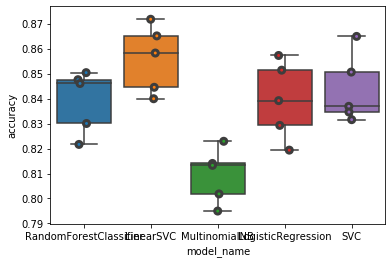

# Exoplanet Exploration

## Background

Over a period of nine years in deep space, the NASA Kepler space telescope has been out on a planet-hunting mission to discover hidden planets outside of our solar system.

The machine learning models in this jupyter notebook can classify candidate exoplanets from the raw dataset.

## Compare Basic ML Models

## RandomForestClassifier(accuracy=0.84)

                precision    recall  f1-score   support

     CANDIDATE       0.83      0.51      0.63       529
     CONFIRMED       0.74      0.85      0.79       568
     FALSEPOSITIVE   0.90      0.99      0.94      1089
 
===========================================================

## LinearSVC(accuracy=0.85)

                precision    recall  f1-score   support

     CANDIDATE       0.77      0.58      0.66       529
     CONFIRMED       0.69      0.82      0.75       568
     FALSEPOSITIVE   0.98      1.00      0.99      1089

===========================================================

## MultinomialNB(accuracy=0.81)

                precision    recall  f1-score   support

     CANDIDATE       0.84      0.29      0.43       529
     CONFIRMED       0.59      0.93      0.72       568
     FALSEPOSITIVE   0.98      1.00      0.99      1089

===========================================================

## LogisticRegression(accuracy=0.84)

                precision    recall  f1-score   support

     CANDIDATE       0.73      0.56      0.63       529
     CONFIRMED       0.67      0.79      0.72       568
     FALSEPOSITIVE   0.98      1.00      0.99      1089

===========================================================

## SVC(accuracy=0.85)

                precision    recall  f1-score   support

     CANDIDATE       0.78      0.55      0.64       529
     CONFIRMED       0.67      0.84      0.75       568
     FALSEPOSITIVE   0.98      1.00      0.99      1089

===========================================================
===========================================================

# Compare GridSearch Models
- - -
### GridSearchCV Model with a linear kernel(accuracy=0.89)

                 precision    recall  f1-score   support

     CANDIDATE       0.85      0.69      0.76       529
     CONFIRMED       0.76      0.87      0.81       568
     FALSEPOSITIVE   0.98      1.00      0.99      1089

### GridSearchCV Model with an rbf  kernel(accuracy=0.89)

               precision    recall  f1-score   support

     CANDIDATE       0.84      0.71      0.77       529
     CONFIRMED       0.77      0.85      0.81       568
     FALSEPOSITIVE   0.98      1.00      0.99      1089

## Resources

* [Exoplanet Data Source](https://www.kaggle.com/nasa/kepler-exoplanet-search-results)

- - -
